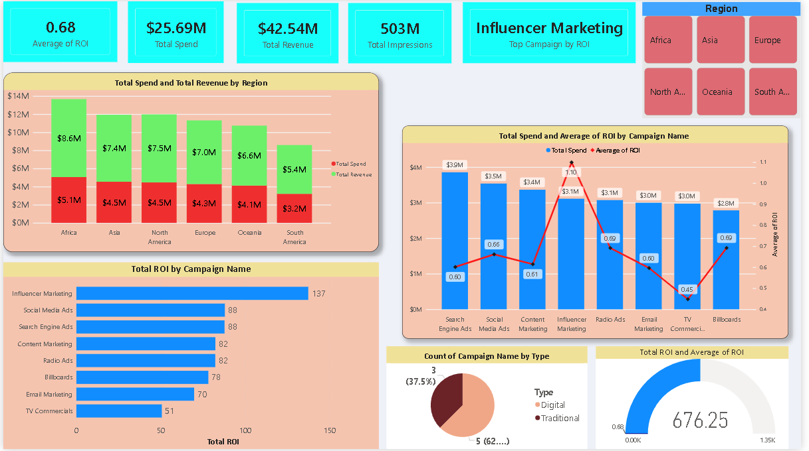

# 📊 Marketing Campaign Performance Analysis Dashboard

## 🚀 Project Overview
This project presents an **interactive Power BI dashboard** that analyzes marketing campaign performance across multiple **regions, campaign types, and channels**.

The goal is to help stakeholders understand:
- Where money is being spent
- Which campaigns generate the highest ROI
- How different regions and marketing types perform

This project reflects a **real-world data analyst workflow** with a strong focus on **business impact and decision-making**.

---

## 🎯 Objectives
- Analyze **Total Spend vs Total Revenue** by region
- Evaluate **ROI across marketing campaigns**
- Identify **top-performing campaigns**
- Compare **Digital vs Traditional marketing effectiveness**
- Build **executive-level KPIs** for quick insights

---

## 📌 Key KPIs
- **Average ROI**
- **Total Marketing Spend**
- **Total Revenue**
- **Total Impressions**
- **Top Campaign by ROI**

These KPIs provide a high-level summary of marketing performance at a glance.

---

## 📈 Key Insights

### 🔹 Regional Performance
- **Africa and Asia** generate higher revenue relative to marketing spend
- **South America** shows lower ROI, highlighting optimization opportunities

### 🔹 Campaign Performance
- **Influencer Marketing** delivers the **highest ROI**
- **Digital campaigns** consistently outperform traditional campaigns
- **TV Commercials** have lower ROI despite higher spend

### 🔹 Marketing Type Analysis
- Digital marketing dominates in both **count and ROI contribution**
- Traditional marketing still contributes but requires better targeting

---

## 🛠 Tools & Technologies
- **Power BI** – Dashboard development, DAX measures, slicers
- **CSV / Excel** – Data storage and preprocessing
- **Data Modeling** – Relationships, calculated measures
- **GitHub** – Version control and project sharing

---

## 🧠 Business Value
This dashboard helps organizations:
- Optimize marketing budgets
- Focus on high-ROI campaigns
- Improve region-wise marketing strategy
- Make data-driven investment decisions

It demonstrates how **data analytics directly supports business growth**.

## 👤 Author
**Shaik Mohammad Jeelan**  
📊 Aspiring Data Analyst  
🛠 Power BI | SQL | Python | Data Visualization  
---

## 📸 Dashboard Preview

---

## 👀 Why This Project Stands Out
✔ Real-world marketing use case  
✔ Strong KPI storytelling  
✔ Clean and professional dashboard design  
✔ Business-oriented insights  
 

---

## ⭐ Support
If you like this project, consider giving it a ⭐ on GitHub!
